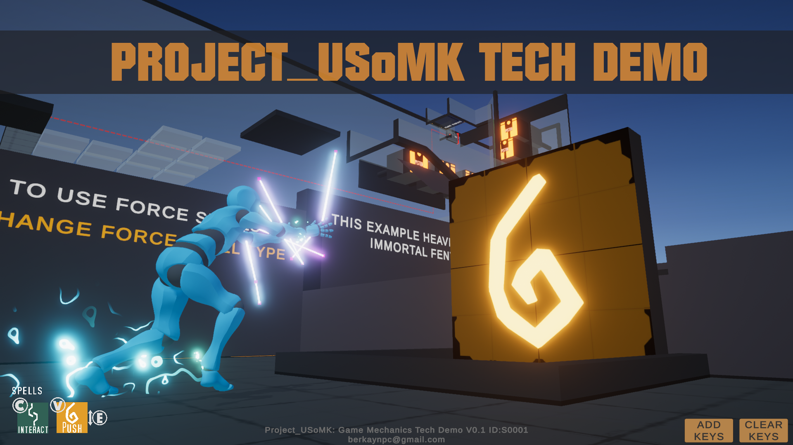
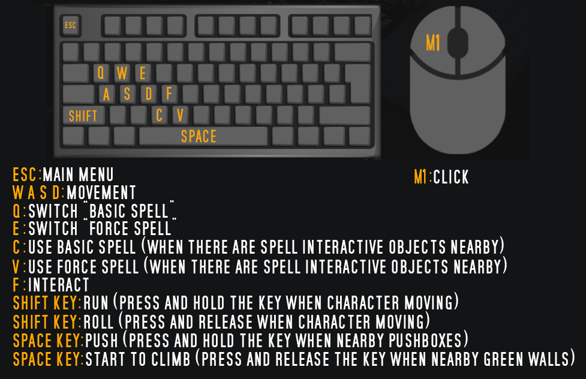

#  Project_USoMK

Project_USoMK is the first step in creating an Action-Adventure style game with isometric camera angle and continues to be developed as a tech demo. From the beginning of this project, it was basically aimed to create new game mechanics, design platforms and puzzles. In the next stages, it was planned to develop combat / combat system, enemies, inventory system, dialogue system, new movement mechanics. Given these developments, the genre of the game may change in the future.

   

# Map
<table><tr><th> MAP </th><th>LEVEL -2 : Pressure Plates</th></tr>
<tr> <td>  </td>
<td>  </td></tr>
<tr><th> LEVEL -1 : Buttons </th> <th> LEVEL 0 : Objects and Prefabs</th></tr>
<tr><td>  </td>
<td>  </td>
<tr><th> LEVEL 1-2-3-4 : Basic Examples </th> <th> LEVEL 5 : Test Platformer Level </th></tr>
<tr><td>  </td>
<td>  </td></tr>
</table>

# Controls

# Project_USoMK Demo Gameplay

# Branches
There are two branches in this project. Of these, "V0_1(OLD)" is the first branch created in the project. The basis of the game mechanics is coded here, platforms and puzzles are designed. In the V0.1 version, problems such as manually connecting many objects, repetitive mesh usage, and texture sizes are seen. The problems experienced in the V0.1 version of the project in the "V0_12" branch have been resolved. To take a quick look at these fixes:

  * Observer: There was switched to observer pattern rather than link objects manually using Custom Game Events.Controller objects can now trigger target objects with "string targetID".
  * Object Pooling: Object pooling was planned to prevent the problem since Spawners and Duplicators that instantiate and destroy object causes memory problems.
  * Base classes such as Object Base, Controller Base were coded and integrated to objects used.
  * Color change of materials is optimized using material property block.
  * Mesh was arranged to prevent unnecessary copying of some mesh. Mesh is optimized.
  * Adjusted the quality and size of some textures to reduce memory usage of textures.

# Assets
Some third party packages were used in the project. These:
* The characters and animations used in the project are taken from Mixamo.
* Spell icons and textures have been redesigned in accordance with the demo, taking 1-2 textures from the Synty Studio - Polygon Dungeon asset.

* As the model of Requirements keys, the key model from the INSTANT ZOOMIES - Horror Starter Pack FREE asset was used.

# Profiler Results
As a result of the build, the demo used memory between 185-210 MB. In the memory profiler, a large part of this ram usage is due to the settings of the scene camera such as anti-aliasing and bloom under the name of RenderTexture.

  
  
# Upcoming

<table><tr><th>Combat System</th> <td>  </td> </tr>
  <tr><th>Damage System</th> <td>  </td> </tr>
  <tr><th>Inverse Kinematics</th> <td>  </td> </tr>
  <tr><th>Gravity Zones</th> <td>  </td> </tr>  
   <tr><th>Wall Jump</th> <td>  </td> </tr>  
  <tr><th>New Spell Types</th> <td>  </td> </tr>
</table>

